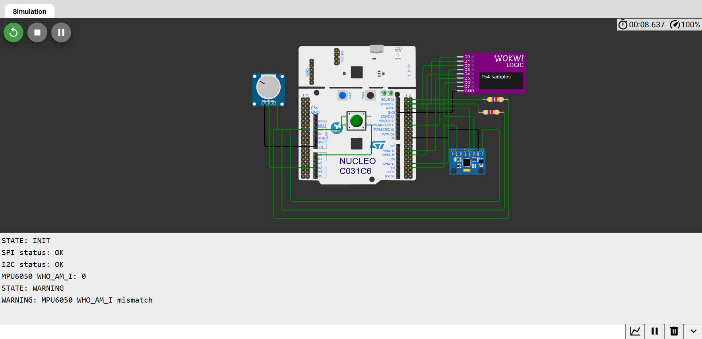
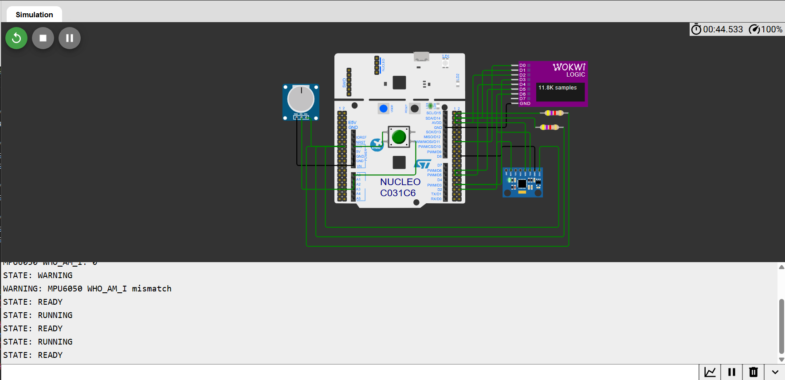
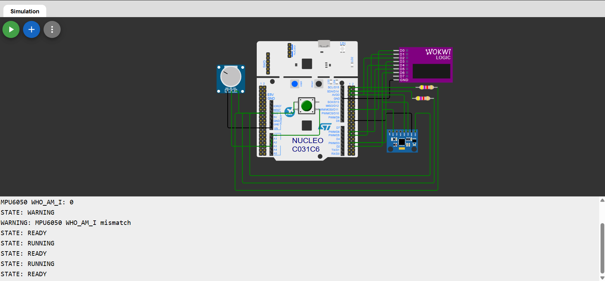

# STM32 Bare-Metal Embedded Controller & Diagnostic Firmware

A register-level embedded firmware project for the **STM32C031C6 ARM Cortex-M0+** microcontroller.

The project demonstrates peripheral configuration, hardware control, communication protocols and diagnostic techniques without using the STM32 HAL.

## Project Status

| Feature | Status |
|---|---|
| GPIO input and output | Completed |
| EXTI button interrupt | Completed |
| SysTick timebase and debounce | Completed |
| UART diagnostics | Completed |
| ADC potentiometer reading | Completed |
| TIM3 PWM generation | Completed |
| SPI1 driver and loopback test | Completed |
| SPI timeout and status handling | Completed |
| I²C1 register-read driver | Implemented |
| I²C timeout and status handling | Completed |
| MPU6050 `WHO_AM_I` validation | Implemented; Wokwi returns unexpected value |
| Application state machine | Completed |
| Safe PWM and LED fault behavior | Completed |
| Driver error/status handling | Completed for SPI and I²C |
| ADC and PWM range validation | Completed |
| Main application integration | Completed |
| Complete application behavior test | Completed in Wokwi |
| Physical I²C verification | Planned |
| Architecture diagram | Planned |
| State-machine diagram | Planned |
| Final physical-hardware test documentation | Planned |

## Implemented Features

### GPIO and Interrupts

- GPIO register configuration
- User-button input
- LED output control
- Rising and falling-edge EXTI interrupts
- SysTick-based button debounce
- Atomic GPIO control using the BSRR register

### UART Diagnostics

- USART2 configured for `115200 8N1`
- String and integer transmission
- Runtime status messages
- Peripheral troubleshooting and stage markers
- Non-blocking receive experiments

### ADC

- 12-bit ADC conversion
- Potentiometer input
- End-of-conversion flag handling
- ADC values transmitted through UART
- ADC value mapped to PWM duty cycle

### Timers and PWM

- TIM3 configured for PWM generation
- 48 MHz system clock
- 1 MHz timer counter
- 500 Hz PWM output
- Adjustable duty cycle through the CCR register

### SPI

- SPI1 controller configuration
- SCK, MOSI, MISO and software-controlled CS
- SPI mode 0
- 8-bit full-duplex transfers
- Loopback transfer testing
- Logic-analyzer verification

### I²C

- I²C1 register-level configuration
- Open-drain SDA and SCL pins
- External 4.7 kΩ pull-up resistors
- MPU6050 device address: `0x68`
- `WHO_AM_I` register address: `0x75`
- ACK/NACK and transaction-stage diagnostics

The I²C driver is retained in the project, but the MPU6050 `WHO_AM_I` test has not been completed successfully in Wokwi. Logic-analyzer captures indicate a simulator-specific transaction issue. Verification on physical hardware remains planned.


Example startup output:

```text
STATE: INIT
SPI status: OK
I2C status: OK
MPU6050 WHO_AM_I: 0
STATE: WARNING
WARNING: MPU6050 WHO_AM_I mismatch
STATE: READY
STATE: RUNNING

## Pin Configuration

| Function | STM32 pin |
|---|---|
| User button | PA0 |
| Potentiometer ADC | PA1 |
| USART2 TX | PA2 |
| USART2 RX | PA3 |
| LD4 LED | PA5 |
| TIM3 PWM output | PA6 |
| SPI1 SCK | PB3 |
| SPI1 MISO | PB4 |
| SPI1 MOSI | PB5 |
| SPI chip select | PB0 |
| I²C1 SCL | PB8 |
| I²C1 SDA | PB9 |

## Project Structure

```text
stm32-baremetal-controller/
└── baremetal/
    ├── include/                Driver header files
    ├── src/                    Application and driver source files
    ├── startup_stm32c0xx.s     Startup code and vector table
    ├── system_stm32c0xx.c      System clock definitions
    ├── flash.ld                Linker script
    └── Makefile                Build configuration
```

## Building the Firmware

### Requirements

- GNU Make
- `arm-none-eabi-gcc`
- WSL or Linux
- Wokwi for simulation

### Build Commands

From the repository root:

```bash
make -C baremetal clean
make -C baremetal
```

Alternatively, from inside the `baremetal` directory:

```bash
make clean
make
```

## Development Environment

- STM32 Nucleo-C031C6
- ARM Cortex-M0+
- C / Embedded C
- CMSIS device headers
- Direct peripheral-register access
- GNU Arm Embedded Toolchain
- Make
- Git and GitHub
- Wokwi simulator
- Logic analyzer
- VS Code with WSL

## Design Goals

- Understand STM32 peripherals at register level
- Avoid high-level HAL abstractions
- Build reusable peripheral drivers
- Apply modular firmware architecture
- Add UART-based diagnostics
- Implement timeouts and safe error handling
- Create a portfolio-ready embedded firmware project


## Architecture 

Button/EXTI ─┐
ADC ─────────┤
SPI ─────────┤
I2C ─────────┤
             v
         app.c state machine
             |
       UART / PWM / LED 

## Screenshots and Test Evidence

The following screenshots show UART diagnostics, state transitions, and PWM/logic-analyzer verification.







Raw Wokwi logic-analyzer capture:

[Open the VCD capture](docs/wokwi-logic.vcd)


## Next Steps

- Verify MPU6050 I²C communication on physical STM32 hardware
- Add an architecture diagram
- Add a state-machine diagram
- Capture final annotated logic-analyzer screenshots
- Document physical-hardware test results
- Perform final source-code formatting and cleanup
- Add final physical-hardware verification results to the README

## Current Limitation

The MPU6050 `WHO_AM_I` transaction does not currently return the expected value in the Wokwi simulation. The firmware confirms that `0x75` reaches the I²C driver, but the captured simulated transaction does not transmit the expected register byte.

This limitation is documented instead of hiding the unsuccessful test. The driver will be tested again using physical STM32 hardware.

Learning Outcomes
This project demonstrates practical experience with:
- Bare-metal ARM Cortex-M0+ firmware
- STM32 peripheral registers
- GPIO
- EXTI
- Interrupt handling
- SysTick
- Button debounce
- UART
- ADC
- Timers
- PWM
- SPI
- I²C
- Timeout handling
- Peripheral diagnostics
- State machines
- Fault handling
- Safe-output design
- Modular firmware architecture
- Logic-analyzer debugging
- Embedded-system testing


Summary
This project started as a collection of independent bare-metal STM32 peripheral experiments and evolved into an integrated embedded controller.
The final application includes:
- Reusable peripheral drivers
- A centralized application state machine
- Safe output behavior
- Recoverable warnings
- Fatal error handling
- Driver status codes
- UART diagnostics
- ADC-controlled PWM
- SPI loopback validation
- I²C sensor diagnostics
- Logic-analyzer verification
The remaining major validation step is physical-hardware testing of the MPU6050 I²C transaction.

